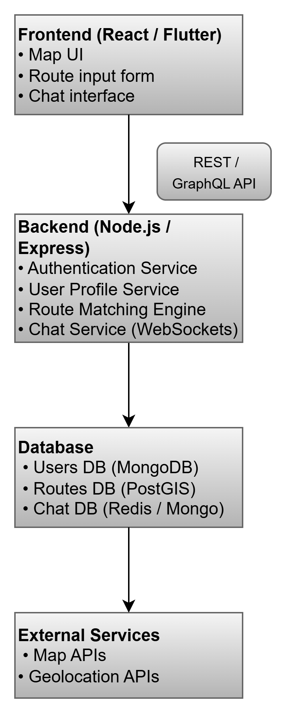

# Student Commute Optimizer

## 📌Overview
The **Student Commute Optimizer** is a full-stack carpooling and route-sharing application for students.  
Instead of each student commuting individually, the system **matches students traveling along similar routes** and allows them to **share rides efficiently, safely, and anonymously.**

## 💡 Why I Chose This Problem Statement
- Daily student commute is often inefficient, expensive, and time-consuming.
- Many students travel on similar routes but separately, leading to increased costs and traffic congestion.
- Solving this problem directly impacts students’ lives by reducing their travel burden and costs.
- It also aligns with green and sustainable transportation goals.

## 💡 Proposed Solution
- Build a **web application (or mobile app)** that:
  - Allows students to enter their **home location and destination.**
  - Shows **nearby students with similar routes** on a **map interface.**
  - Lets them **connect anonymously via in-app chat.**
  - Generates **unique usernames** to maintain **privacy and safety.**
- The system will:
  - Analyze route data from all students.
  - Find **overlapping or nearby paths.**
  - **Suggest suitable matches** for carpooling.

## ⚙️ Core Features
**Frontend (Student-facing)**
- Map interface to enter home and destination.
- Visualizes nearby students traveling on similar routes.
- Anonymous student icons on the map.
- Click to chat with nearby students for planning rides.

**Backend (System Operations)**
- Stores and processes student location data.
- Compares routes using geolocation + route matching algorithms.
- Finds overlaps and proximity-based matches.
- Generates unique usernames (not real names) for anonymity.
- Provides secure chat API to enable communication.

## 🧩 Tech Stack
**Frontend:** React.js, Leaflet.js (map), TailwindCSS  
**Backend:** Node.js, Express.js  
**Database:** MongoDB with geospatial indexing  
**Real-time Chat:** WebSocket / Socket.IO  
**Maps & Geolocation:** OpenStreetMap API / Google Maps API  
**Authentication:** JWT + school email/OTP verification

## System Design Considerations
- **Scalability:** Horizontal scaling of backend using load balancer and stateless API.
- **Security:** JWT authentication, rate limiting on APIs, and input validation.
- **Privacy:** Students stay anonymous until they choose to reveal their identity in chat.
- **Data Storage:** Geospatial queries on MongoDB to find nearby routes efficiently.
- **Fail-Safe:** Fallback to nearest bus stop suggestions if no matches found.

## 🧪Testing Strategy
- **Unit Tests:** Route matching algorithm and chat module.
- **Integration Tests:** Frontend-backend API flow and authentication.
- **User Testing:** Small batch of students test usability and match accuracy.

## 🧠 Thought Process & Design Decisions

| Decision            | Reasoning                             | Trade-off                                     |
|----------------|---------------------------------------------|-------------------------------------------------------------------|
| Anonymous Usernames        | Protect privacy until students agree to chat                       | Harder to verify real identity    |
| Geospatial DB (MongoDB) |Easy to run proximity & route overlap queries  | Less relational, but scalable                          |
| Map Interface (React + Leaflet)         | Simple to visualize user routes        |Requires API integration effort |
| Real-time Chat (WebSocket)        | Allows instant communication                      | Requires state management      |
| Backend (Node.js + Express)  | Scalable and widely used for full-stack JS           | Needs proper async handling             |

**Key Trade-offs:**  
- Real-time chat increases complexity but improves user experience.  
- Using external map APIs adds cost but saves development time and improves accuracy.  
- Anonymity ensures safety but might delay trust-building between students (solved by optional profile reveal after chat).

## 🗺️ High-Level Architecture
**How it works:**

## 🎯 Goals (MVP constraints)
- Register/verify student (school email / phone).
- Let students create a trip: origin, destination, time, role (driver/rider), capacity.
- Compute route & display on map.
- Suggest matches based on route overlap + time proximity.
- Provide anonymized unique usernames + in-app chat.
- Allow confirming a ride and simple notifications.

## ✅Summary
This system helps students save travel cost, reduce traffic, and promote sustainability
while protecting their identity and ensuring a safe carpooling experience.
